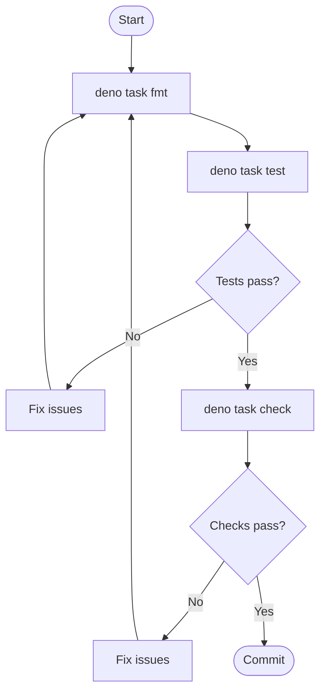

# Contributing

This guide describes how to set up a development environment and the workflow
for contributing to tsunagiya.

---

## 1. Development Environment Setup

### Requirements

- **Deno v1.40 or higher**

Check your installed version:

```bash
deno --version
```

### Verify the Setup

After cloning the repository, run the following to confirm everything is
working:

```bash
deno task check
```

This runs type checking, lint, and format verification in one step.

---

## 2. Available Commands

```bash
deno task test          # Run tests
deno task check         # Type check + lint + format check
deno task fmt           # Format code
deno publish --dry-run  # JSR publish preview
```

---

## 3. Directory Structure

```
src/
├── mod.ts              # Main entry point
├── pool.ts             # MockPool
├── relay.ts            # MockRelay
├── websocket.ts        # MockWebSocket
├── filter.ts           # Filter matching
├── auth.ts             # NIP-42 AUTH
├── types.ts            # Type definitions
├── logger.ts           # Logging
└── testing/
    ├── mod.ts          # Test helpers entry point
    ├── event_builder.ts
    ├── filter_builder.ts
    ├── assertions.ts
    ├── stream.ts
    └── snapshot.ts

tests/
├── pool_test.ts
├── relay_test.ts
├── websocket_test.ts
├── filter_test.ts
├── auth_test.ts
├── integration_test.ts
└── testing/
    ├── event_builder_test.ts
    ├── filter_builder_test.ts
    ├── assertions_test.ts
    ├── stream_test.ts
    └── snapshot_test.ts
```

---

## 4. Development Workflow

Follow this workflow for every change:



1. `deno task fmt` — Auto-format code (**always run this first**)
2. `deno task test` — Run tests
3. `deno task check` — Quality check (type check + lint + format)
4. If any errors occur, fix them and re-run from `deno task fmt`
5. Commit after all checks pass

> **Important:** Always run `deno task fmt` first to prevent format errors from
> polluting later check output.

---

## 5. Coding Conventions

- **Zero external dependencies** — Use the Deno standard library only
- **Node.js compatibility** — Keep the library usable in Node.js environments
- **TypeScript strict mode** — All code must pass strict type checking
- **`any` is forbidden** — Use `unknown` instead
- **Always call `pool.uninstall()` in tests** — Wrap in a `finally` block to
  guarantee cleanup even on test failure
- **Error messages in English**
- **JSDoc comments** — Can be written in Japanese; required for all public APIs

---

## 6. E2E Testing

### Deno

```bash
deno task test    # Run all tests (uses the -A flag for full permissions)
```

The `test` task in `deno.json` passes `-A` (all permissions) to Deno. If you
need stricter permission control, specify flags such as
`--allow-net --allow-read` explicitly.

### Node.js Compatibility

Because tsunagiya works by replacing `globalThis.WebSocket`, a WebSocket
polyfill (e.g. the `ws` package) is required when running in a Node.js
environment. Testing via IPC (inter-process communication) is not verified.
