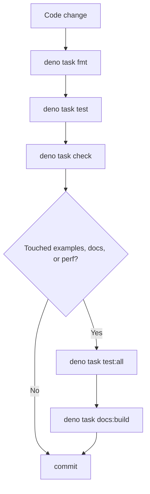

# Contributing

This guide explains the development workflow for tsunagiya.

---

## 1. Development Environment Setup

**Deno v2.x** is required.

```bash
deno --version
```

After cloning the repository, run the quality gate first.

```bash
deno task check
```

`deno task check` includes type checking, lint, format verification, and the
runtime guard in `scripts/guard_runtime_access.ts`.

---

## 2. Available Commands

| Command                | Description                                      |
| ---------------------- | ------------------------------------------------ |
| `deno task test`       | Run unit tests                                   |
| `deno task test:all`   | Run all tests including `examples/`              |
| `deno task check`      | Runtime guard + type check + lint + format check |
| `deno task fmt`        | Format code                                      |
| `deno task docs:build` | Verify the documentation build                   |
| `deno task build:npm`  | Verify the npm package build                     |

```bash
deno task fmt
deno task test
deno task check
deno task test:all   # when touching examples or AUTH/E2E flows
deno task docs:build # when touching docs, README, or shared snippets
```

---

## 3. Directory Structure

```text
src/
├── mod.ts                   # Public entry point
├── pool.ts                  # MockPool facade
├── relay.ts                 # MockRelay facade / orchestration
├── platform/                # WebSocket/fetch hook
├── relay/                   # EventStore, AuthService, DeliveryScheduler, etc.
├── internal/                # clone/runtime/url/validation/search
├── types/                   # Internal type modules
└── testing/                 # EventBuilder / FilterBuilder / stream / wait

tests/
├── *_test.ts                # relay/pool/auth/filter/search/perf regressions
└── testing/                 # helper tests

docs/
├── _shared/                 # Source of truth for snippets and tables
├── reference/               # API / architecture / NIP docs
├── guide/                   # getting-started / tutorial / contributing
└── superpowers/plans/       # decision memos / closeout / perf notes
```

The canonical ownership map lives in
[`2026-03-29-maintainer-operating-rules.md`](/superpowers/plans/2026-03-29-maintainer-operating-rules).

---

## 4. Development Workflow

Use this path for normal changes.



1. `deno task fmt`
2. `deno task test`
3. `deno task check`
4. Run `deno task test:all` if you touched `examples/`, AUTH ordering, or E2E
   compatibility
5. Run `deno task docs:build` if you touched `docs/`, `README.md`, or
   `docs/_shared/**`
6. Commit only after the relevant checks pass

---

## 5. Required CI Paths

GitHub Actions always runs these lanes.

- `guard-runtime-access`: `scripts/guard_runtime_access.ts`
- `test-deno`: `deno task check`, `deno task test`, and coverage
- `docs-check`: docs lint/format plus `deno task docs:build`
- `e2e-*`: Deno / Node / Bun compatibility for example clients

Locally, `deno task check` is the canonical guard entry point. In CI, the guard
also runs in a dedicated job.

---

## 6. Docs / README Sync Rule

The source of truth for docs content is `docs/_shared/snippets/**` and
`docs/_shared/tables/**`. README is only a summary and should not become a copy
of shared snippets.

When updating docs:

1. Edit `docs/_shared/**` first
2. Verify the include targets under `docs/reference/**` and `docs/guide/**`
3. Update README only when the public summary changed
4. Run `deno task docs:build`
5. Update release readiness if the user-facing explanation changed

---

## 7. Performance Baseline Update Rule

Performance work must land with both code and measurement notes.

Required rules:

- Smoke tests belong in `tests/performance_test.ts`
- Threshold baselines belong in `tests/performance_baseline_test.ts`
- Any new fast path needs at least one baseline
- Do not tighten thresholds from a single run
- Record measurements in a dated note under `docs/superpowers/plans/`

Minimum note template:

```md
# YYYY-MM-DD <Area> Notes

## Goal

## Implementation

## Measurement Conditions

- dataset:
- filter/query:
- run count:

## Observations

- median:
- p95:
- memory proxy:

## Threshold Decision

- old threshold:
- new threshold:
- reason:

## Next Decision
```

---

## 8. Coding Conventions

- Public API changes must flow through `src/mod.ts` / `src/testing/mod.ts`
- Avoid `any`; use `unknown` when needed
- Keep error messages in English
- Always guarantee `pool.uninstall()` in tests via `finally`
- Do not add direct `Date.now()` / `Math.random()` / `crypto.getRandomValues()`
  calls to relay core or testing helpers
- Add new ownership or sync rules to the maintainer document before scaling them
  out

---

## 9. E2E Testing

```bash
deno task test      # tests/ only
deno task test:all  # tests/ + examples/
```

Because tsunagiya replaces `globalThis.WebSocket`, a WebSocket polyfill such as
`ws` is required in Node.js environments.
