# Architecture

Tsunagiya is a mock library that makes existing Nostr client code testable
without modification by replacing `globalThis.WebSocket`.

## Overview

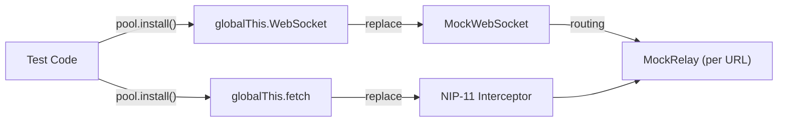
```mermaid
flowchart LR
    TC["Test Code"] -->|"pool.install()"| GWS["globalThis.WebSocket"]
    TC -->|"pool.install()"| GF["globalThis.fetch"]
    GWS -->|"replace"| MWS["MockWebSocket"]
    GF -->|"replace"| NIP11["NIP-11 Interceptor"]
    MWS -->|"routing"| MR["MockRelay (per URL)"]
    NIP11 --> MR
```

---

## Component Structure

```
src/
├── pool.ts         MockPool       — Global manager, WebSocket replacement
├── relay.ts        MockRelay      — Per-URL virtual relay
├── websocket.ts    MockWebSocket  — WebSocket API-compatible mock
├── filter.ts       matchFilter etc — NIP-01 filter matching (pure functions)
├── auth.ts         AuthState      — NIP-42 AUTH challenge/response
├── event_kind.ts                  — Event kind classification (Regular/Replaceable/Ephemeral etc.)
├── logger.ts                      — Logger
└── types.ts                       — Type definitions
```

### Class Relationship Diagram

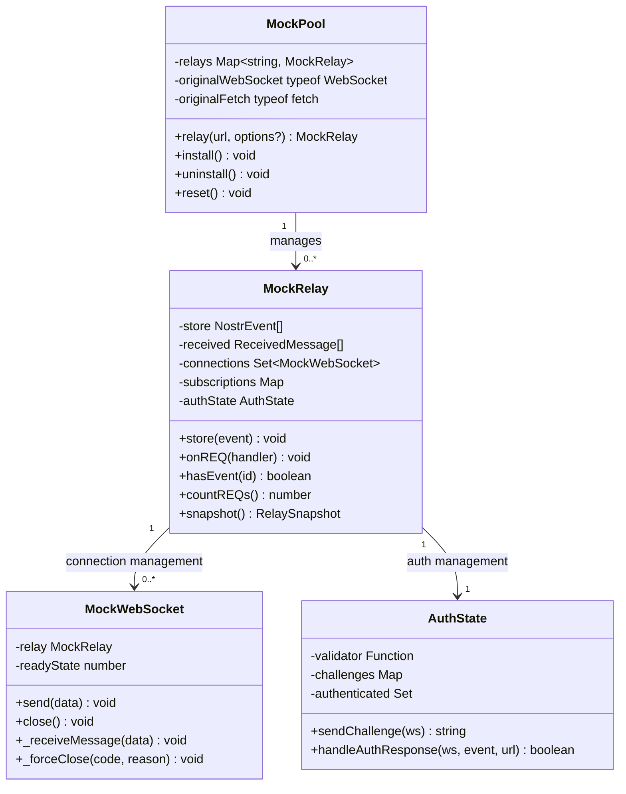
```mermaid
classDiagram
    class MockPool {
        +relay(url, options?) MockRelay
        +install() void
        +uninstall() void
        +reset() void
        -relays Map~string, MockRelay~
        -originalWebSocket typeof WebSocket
        -originalFetch typeof fetch
    }
    class MockRelay {
        +store(event) void
        +onREQ(handler) void
        +hasEvent(id) boolean
        +countREQs() number
        +snapshot() RelaySnapshot
        -store NostrEvent[]
        -received ReceivedMessage[]
        -connections Set~MockWebSocket~
        -subscriptions Map
        -authState AuthState
    }
    class MockWebSocket {
        +send(data) void
        +close() void
        -relay MockRelay
        -readyState number
        +_receiveMessage(data) void
        +_forceClose(code, reason) void
    }
    class AuthState {
        +sendChallenge(ws) string
        +handleAuthResponse(ws, event, url) boolean
        -validator Function
        -challenges Map
        -authenticated Set
    }

    MockPool "1" --> "0..*" MockRelay : manages
    MockRelay "1" --> "0..*" MockWebSocket : connection management
    MockRelay "1" --> "1" AuthState : auth management
```

### MockPool (`src/pool.ts`)

A container that manages multiple MockRelay instances keyed by URL. The entry
point for tests.

| Member               | Type                       | Role                                    |
| -------------------- | -------------------------- | --------------------------------------- |
| `#relays`            | `Map<string, MockRelay>`   | URL → MockRelay mapping                 |
| `#originalWebSocket` | `typeof WebSocket \| null` | Stores original WebSocket for uninstall |
| `#originalFetch`     | `typeof fetch \| null`     | Stores original fetch for uninstall     |

**Key methods:**

- `relay(url, options?)` — Register/retrieve a MockRelay (returns existing
  instance for same URL)
- `install()` — Replaces `globalThis.WebSocket` and `globalThis.fetch`
- `uninstall()` — Restores original implementations
- `reset()` — Clears state of all relays

### MockRelay (`src/relay.ts`)

A virtual Nostr relay operating per URL. Provides event store, filtering, custom
handlers, assertion helpers, instability simulation, and NIP-42 AUTH.

| Field            | Type                                             | Role                              |
| ---------------- | ------------------------------------------------ | --------------------------------- |
| `#store`         | `NostrEvent[]`                                   | Event store (persistent events)   |
| `#received`      | `ReceivedMessage[]`                              | Log of received messages          |
| `#connections`   | `Set<MockWebSocket>`                             | List of active connections        |
| `#subscriptions` | `Map<MockWebSocket, Map<string, NostrFilter[]>>` | Subscriptions per connection      |
| `#authState`     | `AuthState`                                      | NIP-42 authentication state       |
| `#pendingTimers` | `Set<ReturnType<typeof setTimeout>>`             | Pending timers (cleared on reset) |

### MockWebSocket (`src/websocket.ts`)

The replacement for `globalThis.WebSocket`. Extends `EventTarget` to emulate the
WebSocket API.

| Member                      | Role                                              |
| --------------------------- | ------------------------------------------------- |
| `static _resolveRelay`      | URL → MockRelay resolver function set by MockPool |
| `#relay`                    | The MockRelay this socket is routed to            |
| `send(data)`                | Forwards to `relay._handleMessage()`              |
| `_receiveMessage(data)`     | Receive callback invoked by the relay             |
| `_forceClose(code, reason)` | Forced disconnect invoked by the relay            |

### WebSocket readyState Transitions

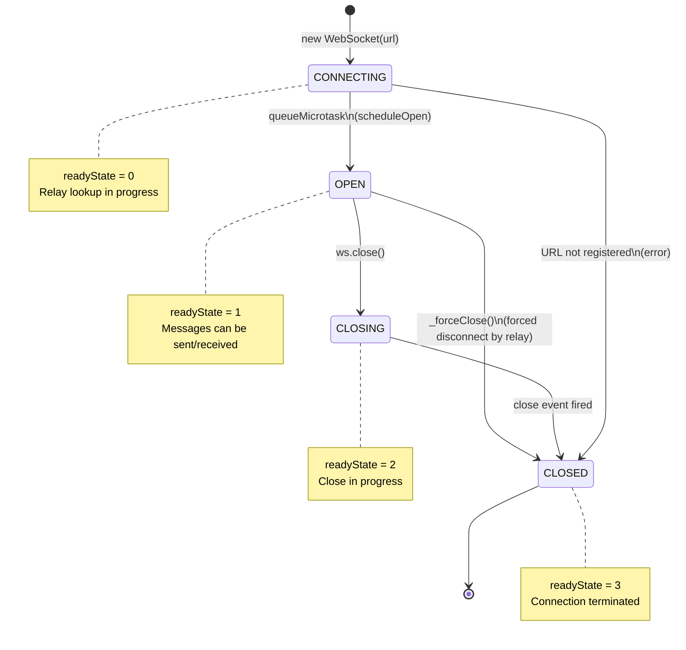
```mermaid
stateDiagram-v2
    [*] --> CONNECTING : new WebSocket(url)
    CONNECTING --> OPEN : queueMicrotask\n(scheduleOpen)
    OPEN --> CLOSING : ws.close()
    OPEN --> CLOSED : _forceClose()\n(forced disconnect by relay)
    CLOSING --> CLOSED : close event fired
    CONNECTING --> CLOSED : URL not registered\n(error)
    CLOSED --> [*]

    note right of CONNECTING
        readyState = 0
        Relay lookup in progress
    end note
    note right of OPEN
        readyState = 1
        Messages can be sent/received
    end note
    note right of CLOSING
        readyState = 2
        Close in progress
    end note
    note right of CLOSED
        readyState = 3
        Connection terminated
    end note
```

### filter.ts

Pure functions for NIP-01 filter matching. No side effects.

| Function                       | Description                                                             |
| ------------------------------ | ----------------------------------------------------------------------- |
| `matchFilter(event, filter)`   | Checks if an event matches a single filter (all conditions AND)         |
| `matchFilters(event, filters)` | Checks if an event matches any of multiple filters (OR between filters) |
| `filterEvents(events, filter)` | Filters event array, sorts descending, applies limit                    |

### auth.ts (NIP-42)

Manages AUTH challenge/response per connection.

| Member                               | Role                                                |
| ------------------------------------ | --------------------------------------------------- |
| `#validator`                         | Custom validator function                           |
| `#challenges`                        | Connection → challenge string mapping               |
| `#authenticated`                     | Set of authenticated connections                    |
| `sendChallenge(ws)`                  | Generates a random challenge and sends AUTH message |
| `handleAuthResponse(ws, event, url)` | Validates kind:22242 AUTH response                  |

---

## WebSocket Interception Mechanism

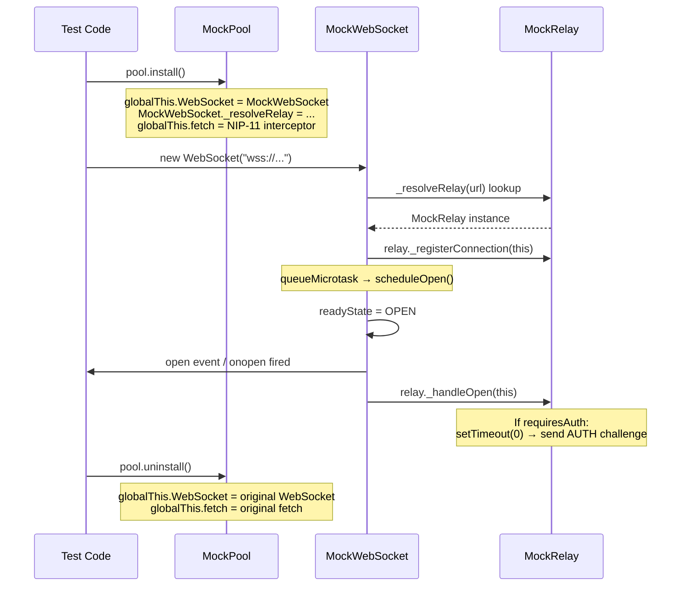
```mermaid
sequenceDiagram
    participant TC as Test Code
    participant MP as MockPool
    participant MWS as MockWebSocket
    participant MR as MockRelay

    TC->>MP: pool.install()
    Note over MP: globalThis.WebSocket = MockWebSocket<br>MockWebSocket._resolveRelay = ...<br>globalThis.fetch = NIP-11 interceptor

    TC->>MWS: new WebSocket("wss://...")
    MWS->>MR: _resolveRelay(url) lookup
    MR-->>MWS: MockRelay instance
    MWS->>MR: relay._registerConnection(this)
    Note over MWS: queueMicrotask → scheduleOpen()

    MWS->>MWS: readyState = OPEN
    MWS->>TC: open event / onopen fired
    MWS->>MR: relay._handleOpen(this)
    Note over MR: If requiresAuth:<br>setTimeout(0) → send AUTH challenge

    TC->>MP: pool.uninstall()
    Note over MP: globalThis.WebSocket = original WebSocket<br>globalThis.fetch = original fetch
```

---

## Message Flow

### Client → Relay (send)

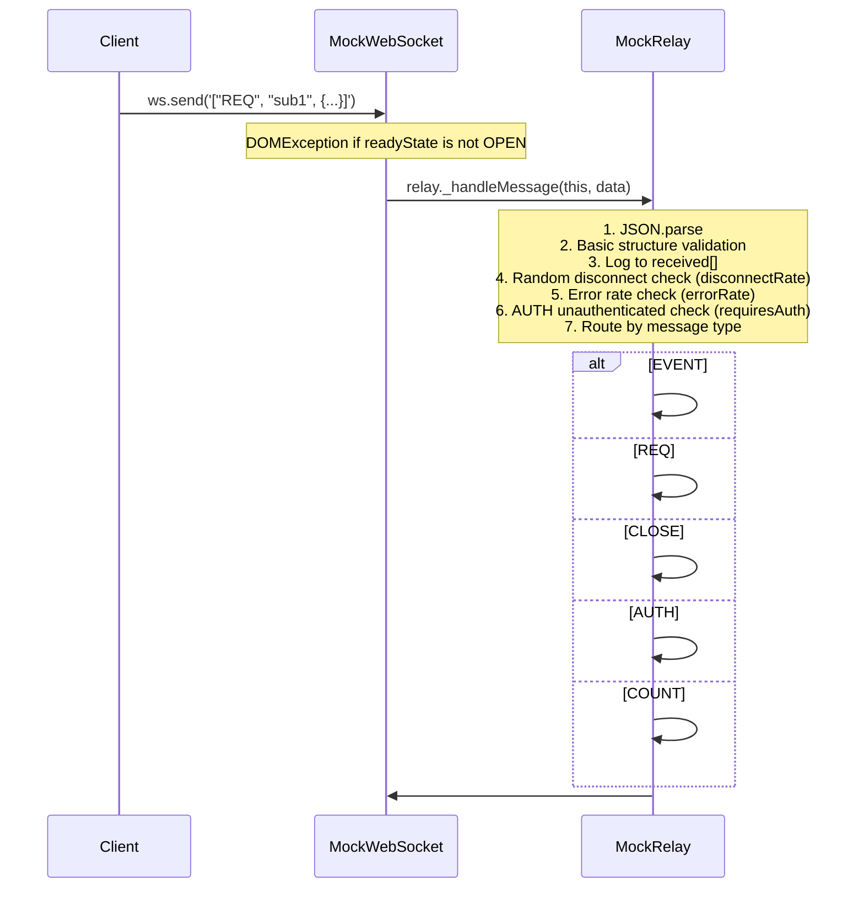
```mermaid
sequenceDiagram
    participant C as Client
    participant MWS as MockWebSocket
    participant MR as MockRelay

    C->>MWS: ws.send('["REQ", "sub1", {...}]')
    Note over MWS: DOMException if readyState is not OPEN
    MWS->>MR: relay._handleMessage(this, data)

    Note over MR: 1. JSON.parse<br>2. Basic structure validation<br>3. Log to received[]<br>4. Random disconnect check (disconnectRate)<br>5. Error rate check (errorRate)<br>6. AUTH unauthenticated check (requiresAuth)<br>7. Route by message type

    alt EVENT
        MR->>MR: #handleEvent()
    else REQ
        MR->>MR: #handleReq()
    else CLOSE
        MR->>MR: #handleClose()
    else AUTH
        MR->>MR: #handleAuth()
    else COUNT
        MR->>MR: #handleCount()
    end

    MR->>MWS: #sendWithLatency(ws, response)
```

### Error Simulation Decision Flow

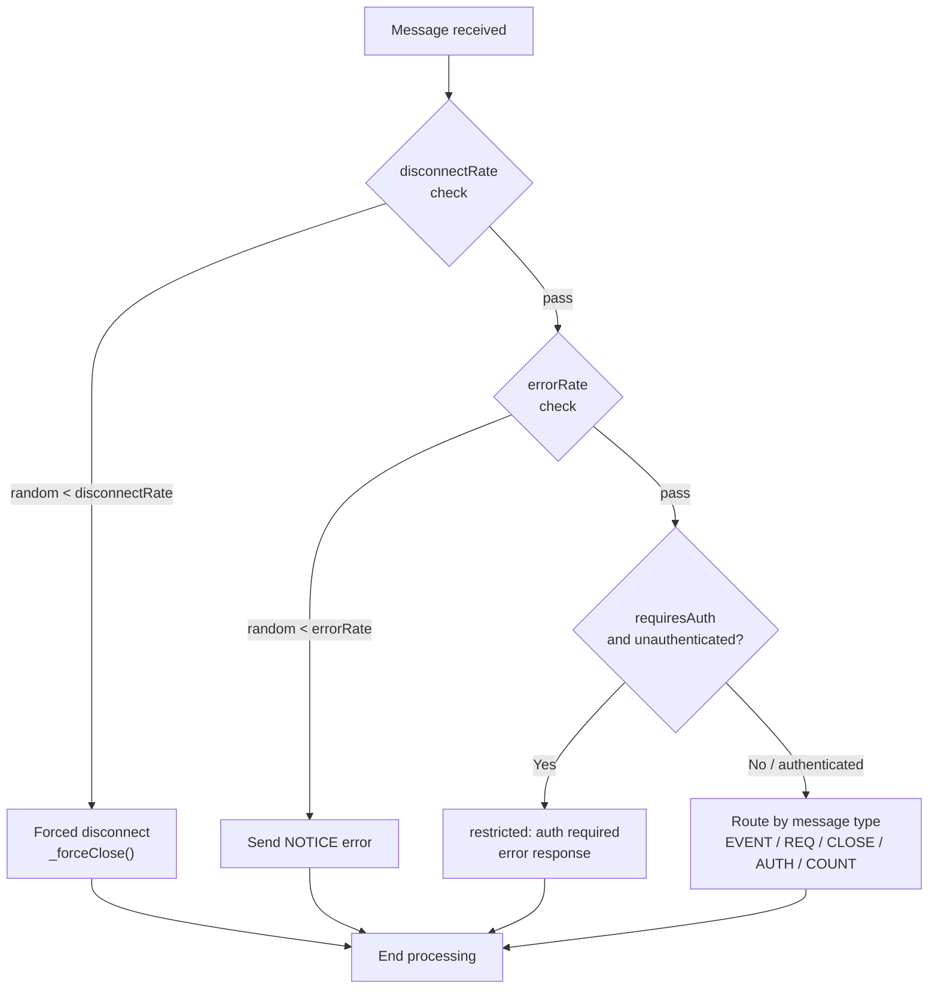
```mermaid
flowchart TD
    Start["Message received"] --> DC{"disconnectRate\ncheck"}
    DC -->|"random < disconnectRate"| FClose["Forced disconnect\n_forceClose()"]
    DC -->|"pass"| EC{"errorRate\ncheck"}
    EC -->|"random < errorRate"| NErr["Send NOTICE error"]
    EC -->|"pass"| Auth{"requiresAuth\nand unauthenticated?"}
    Auth -->|"Yes"| AuthErr["restricted: auth required\nerror response"]
    Auth -->|"No / authenticated"| Route["Route by message type\nEVENT / REQ / CLOSE / AUTH / COUNT"]
    FClose --> End["End processing"]
    NErr --> End
    AuthErr --> End
    Route --> End
```

### Relay → Client (receive)

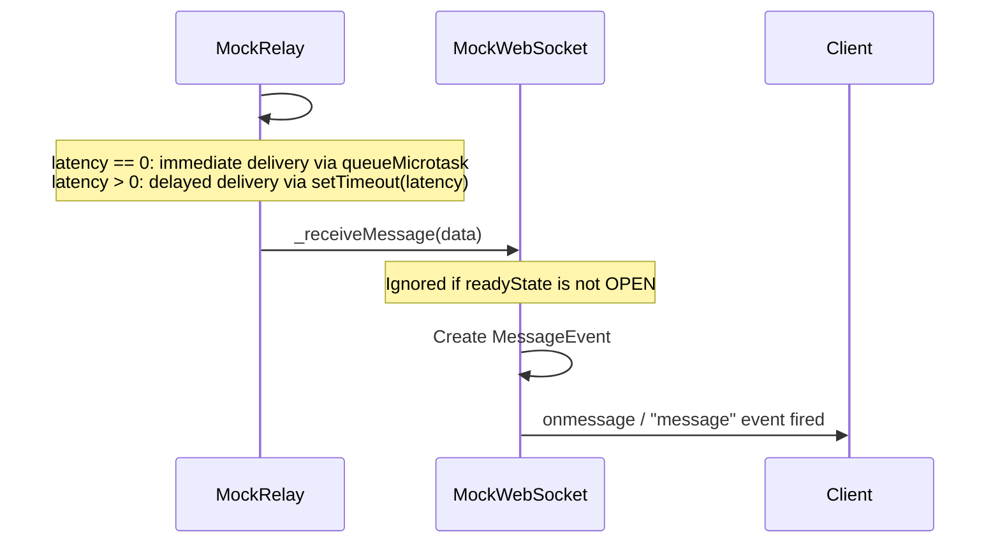
```mermaid
sequenceDiagram
    participant MR as MockRelay
    participant MWS as MockWebSocket
    participant C as Client

    MR->>MR: #sendWithLatency(ws, message)
    Note over MR: latency == 0: immediate delivery via queueMicrotask<br>latency  > 0: delayed delivery via setTimeout(latency)

    MR->>MWS: _receiveMessage(data)
    Note over MWS: Ignored if readyState is not OPEN
    MWS->>MWS: Create MessageEvent
    MWS->>C: onmessage / "message" event fired
```

---

## Data Flow

### Event Store

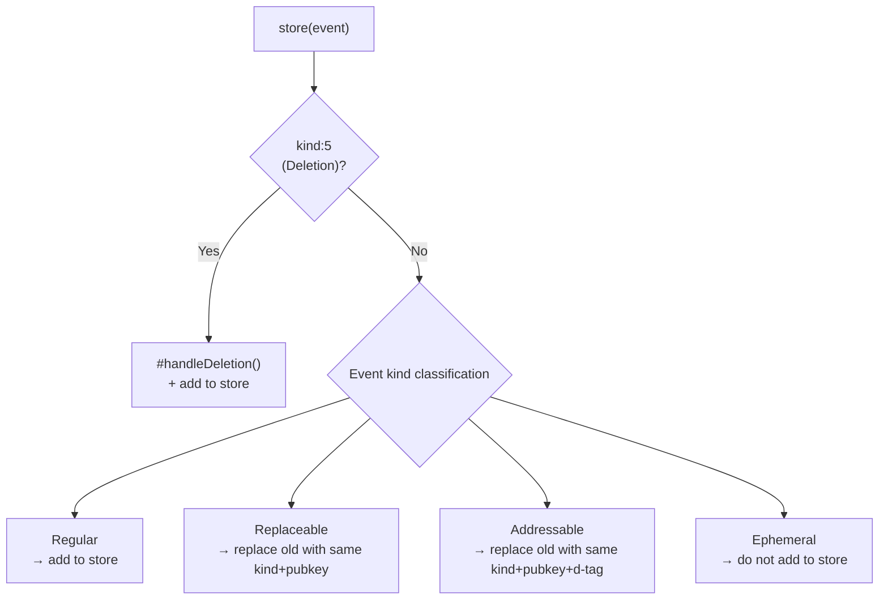
```mermaid
flowchart TD
    Store["store(event)"] --> K5{"kind:5\n(Deletion)?"}
    K5 -->|"Yes"| Del["#handleDeletion()\n+ add to store"]
    K5 -->|"No"| KClass{"Event kind classification"}
    KClass --> Regular["Regular\n→ add to store"]
    KClass --> Repl["Replaceable\n→ replace old with same kind+pubkey"]
    KClass --> ParamRepl["Addressable\n→ replace old with same kind+pubkey+d-tag"]
    KClass --> Ephem["Ephemeral\n→ do not add to store"]
```

### Event Kind Classification Flow

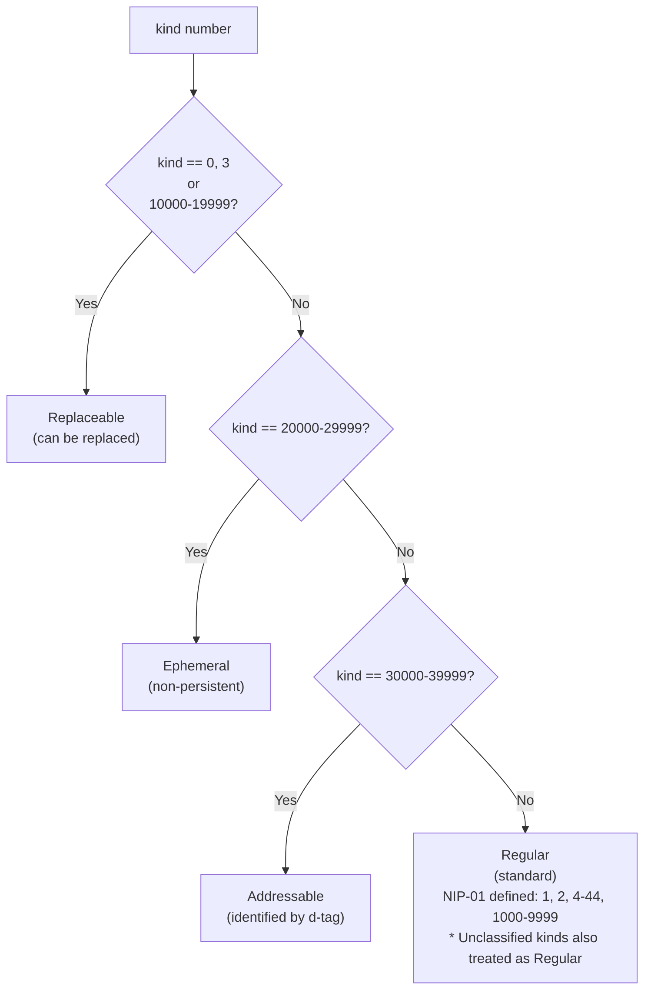
```mermaid
flowchart TD
    Start["kind number"] --> R1{"kind == 0, 3\nor\n10000-19999?"}
    R1 -->|"Yes"| Replaceable["Replaceable\n(can be replaced)"]
    R1 -->|"No"| R2{"kind == 20000-29999?"}
    R2 -->|"Yes"| Ephemeral["Ephemeral\n(non-persistent)"]
    R2 -->|"No"| R3{"kind == 30000-39999?"}
    R3 -->|"Yes"| Addressable["Addressable\n(identified by d-tag)"]
    R3 -->|"No"| Regular["Regular\n(standard)\nNIP-01 defined: 1, 2, 4-44, 1000-9999\n* Unclassified kinds also treated as Regular"]
```

### REQ Processing and Subscription Management

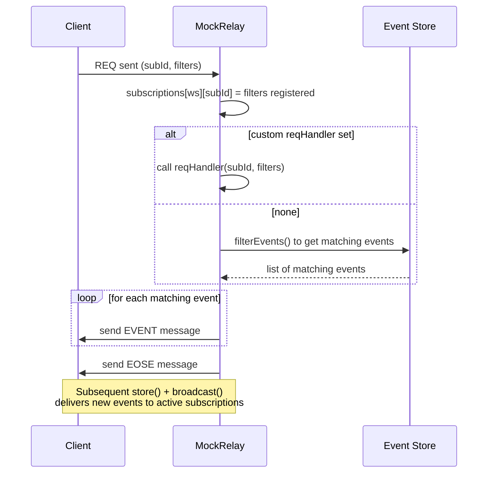
```mermaid
sequenceDiagram
    participant C as Client
    participant MR as MockRelay
    participant Store as Event Store

    C->>MR: REQ sent (subId, filters)
    MR->>MR: subscriptions[ws][subId] = filters registered

    alt custom reqHandler set
        MR->>MR: call reqHandler(subId, filters)
    else none
        MR->>Store: filterEvents() to get matching events
        Store-->>MR: list of matching events
    end

    loop for each matching event
        MR->>C: send EVENT message
    end
    MR->>C: send EOSE message

    Note over MR,C: Subsequent store() + broadcast()<br>delivers new events to active subscriptions
```

### Subscription Data Structure

```
#subscriptions: Map<MockWebSocket, Map<string, NostrFilter[]>>

  ConnectionA ──→ { "sub1": [filter1, filter2],
                    "sub2": [filter3] }
  ConnectionB ──→ { "sub1": [filter4] }
```

---

## NIP Processing Flows

### NIP-42 AUTH Flow

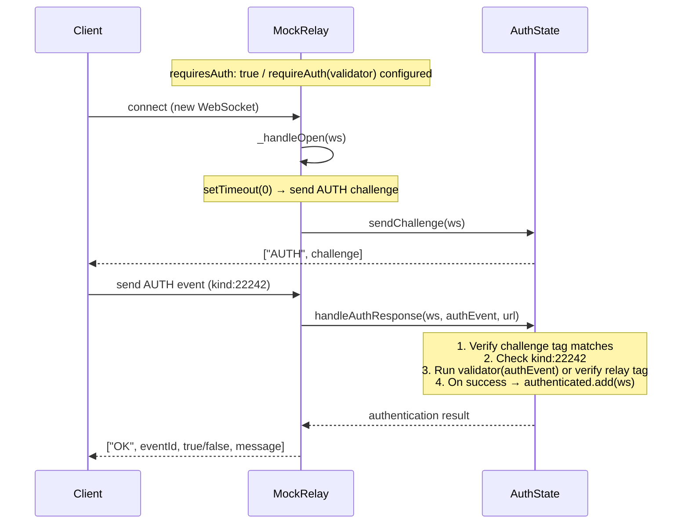
```mermaid
sequenceDiagram
    participant C as Client
    participant MR as MockRelay
    participant AS as AuthState

    Note over MR: requiresAuth: true / requireAuth(validator) configured

    C->>MR: connect (new WebSocket)
    MR->>MR: _handleOpen(ws)
    Note over MR: setTimeout(0) → send AUTH challenge
    MR->>AS: sendChallenge(ws)
    AS-->>C: ["AUTH", challenge]

    C->>MR: send AUTH event (kind:22242)
    MR->>AS: handleAuthResponse(ws, authEvent, url)
    Note over AS: 1. Verify challenge tag matches<br>2. Check kind:22242<br>3. Run validator(authEvent) or verify relay tag<br>4. On success → authenticated.add(ws)
    AS-->>MR: authentication result
    MR-->>C: ["OK", eventId, true/false, message]
```

### NIP-09 Deletion Processing Flow

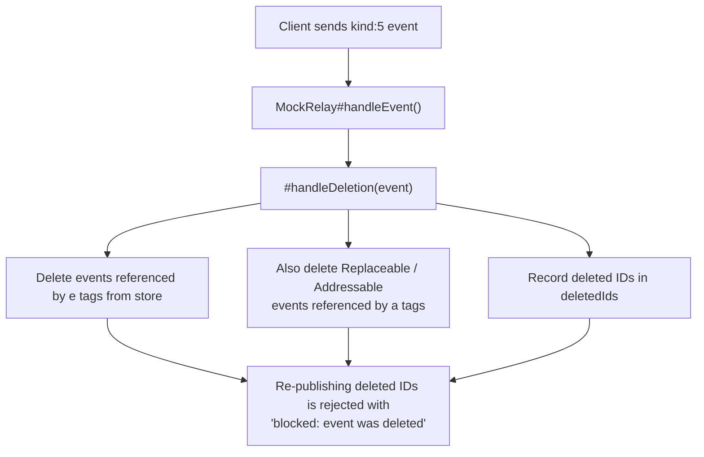
```mermaid
flowchart TD
    Start["Client sends kind:5 event"] --> HE["MockRelay#handleEvent()"]
    HE --> HD["#handleDeletion(event)"]
    HD --> ETag["Delete events referenced by e tags from store"]
    HD --> ATag["Also delete Replaceable / Addressable\nevents referenced by a tags"]
    HD --> Record["Record deleted IDs in deletedIds"]
    ETag --> Block["Re-publishing deleted IDs is rejected with\n'blocked: event was deleted'"]
    ATag --> Block
    Record --> Block
```

### NIP-11 Relay Information Flow

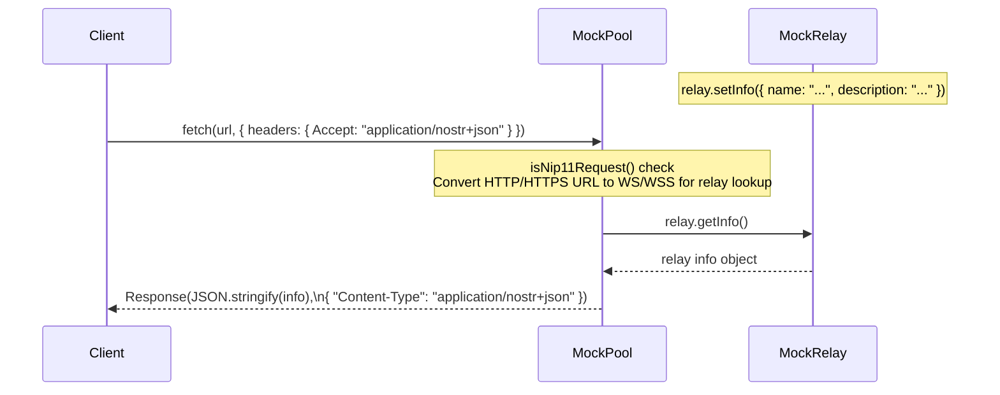
```mermaid
sequenceDiagram
    participant C as Client
    participant MP as MockPool
    participant MR as MockRelay

    Note over MR: relay.setInfo({ name: "...", description: "..." })

    C->>MP: fetch(url, { headers: { Accept: "application/nostr+json" } })
    Note over MP: isNip11Request() check<br>Convert HTTP/HTTPS URL to WS/WSS for relay lookup
    MP->>MR: relay.getInfo()
    MR-->>MP: relay info object
    MP-->>C: Response(JSON.stringify(info),\n{ "Content-Type": "application/nostr+json" })
```

### Event Injection and Real-time Stream

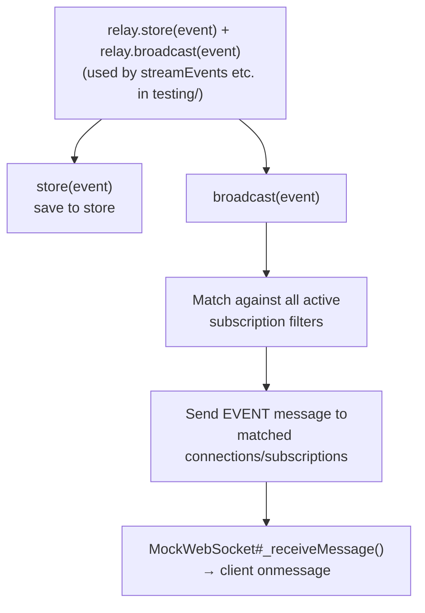
```mermaid
flowchart TD
    Inject["relay.store(event) + relay.broadcast(event)\n(used by streamEvents etc. in testing/)"]
    Inject --> Classify["store(event)\nsave to store"]
    Inject --> Broadcast["broadcast(event)"]
    Broadcast --> Filter["Match against all active\nsubscription filters"]
    Filter --> Match["Send EVENT message to\nmatched connections/subscriptions"]
    Match --> Recv["MockWebSocket#_receiveMessage()\n→ client onmessage"]
```

---

## Test Lifecycle

```typescript
// 1. Initialize
const pool = new MockPool();
const relay = pool.relay("wss://relay.example.com");

// 2. Pre-load data and configuration
relay.store(event); // Pre-register events
relay.onREQ((subId, filters) =>
  // Custom handler
  customEvents
);

// 3. Replace WebSocket
pool.install();

try {
  // 4. Run test (call client code as-is)
  const ws = new WebSocket("wss://relay.example.com");
  // ...

  // 5. Assertions
  relay.hasEvent("abc123"); // Verify event was received
  relay.countREQs(); // Verify REQ count
} finally {
  // 6. Always restore (prevents interference between tests)
  pool.uninstall();
}
```

---

## Test Helper Overview

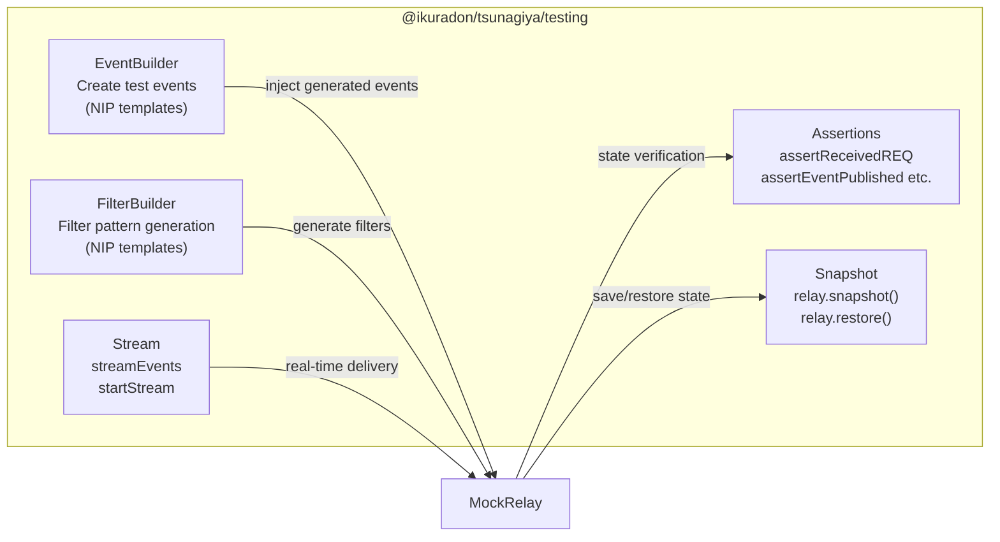
```mermaid
flowchart LR
    subgraph testing ["@ikuradon/tsunagiya/testing"]
        EB["EventBuilder\nCreate test events\n(NIP templates)"]
        FB["FilterBuilder\nFilter pattern generation\n(NIP templates)"]
        Assert["Assertions\nassertReceivedREQ\nassertEventPublished etc."]
        Stream["Stream\nstreamEvents\nstartStream"]
        Snap["Snapshot\nrelay.snapshot()\nrelay.restore()"]
    end

    EB -->|"inject generated events"| MR["MockRelay"]
    FB -->|"generate filters"| MR
    MR -->|"state verification"| Assert
    Stream -->|"real-time delivery"| MR
    MR -->|"save/restore state"| Snap
```

---

## Notes

- **Test interference**: Since replacing `globalThis.WebSocket` is a global
  operation, always call `pool.uninstall()` in the `finally` block of each test.
- **No signature verification**: As a testing library, event signatures are
  treated as plain strings (actual cryptographic processing is not implemented
  to avoid adding dependencies). If you need signature verification, implement
  it yourself in an `onEVENT` handler.
- **Async delivery**: Even with latency 0, responses are delivered
  asynchronously via `queueMicrotask` (returning responses synchronously inside
  `send()` would cause some clients to malfunction).
- **Single instance**: Only one `MockPool` instance can be `install`ed at a
  time.
