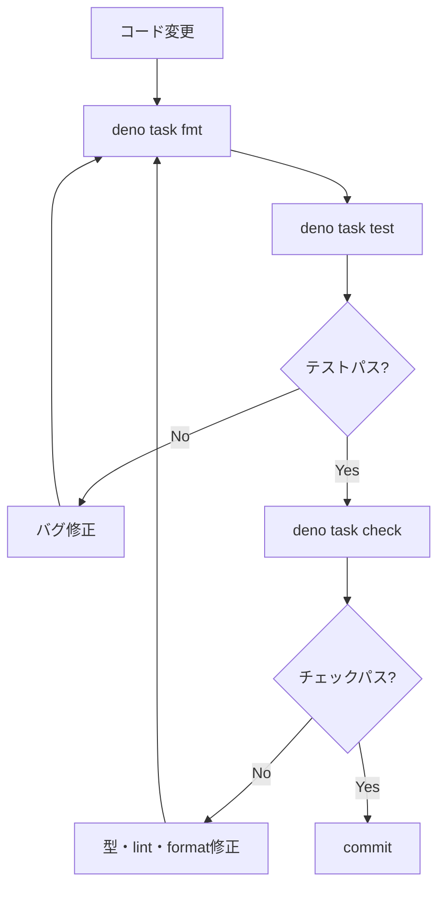

# 開発ガイド

繋ぎ屋 (tsunagiya) への貢献・開発参加のためのガイドです。

---

## 開発環境セットアップ

**Deno v1.40 以上**が必要です。

```bash
deno --version  # v1.40 以上であることを確認
```

セットアップ後、動作確認を行います。

```bash
deno task check  # 型チェック + lint + format確認
```

---

## コマンド一覧

| コマンド | 説明 |
| --- | --- |
| `deno task test` | テスト実行 |
| `deno task check` | 型チェック + lint + format確認 |
| `deno task fmt` | コード自動整形 |
| `deno publish --dry-run` | JSR 公開プレビュー |

```bash
deno task test          # テスト実行
deno task check         # 型チェック + lint + format確認
deno task fmt           # フォーマット
deno publish --dry-run  # JSR公開プレビュー
```

---

## ディレクトリ構造

```
src/
├── mod.ts              # メインエントリポイント
├── pool.ts             # MockPool
├── relay.ts            # MockRelay
├── websocket.ts        # MockWebSocket
├── filter.ts           # フィルターマッチング
├── auth.ts             # NIP-42 AUTH
├── types.ts            # 型定義
├── logger.ts           # ログ機能
└── testing/
    ├── mod.ts          # テスト支援エントリポイント
    ├── event_builder.ts
    ├── filter_builder.ts
    ├── assertions.ts
    ├── stream.ts
    └── snapshot.ts

tests/
├── pool_test.ts
├── relay_test.ts
├── websocket_test.ts
├── filter_test.ts
├── auth_test.ts
├── integration_test.ts
└── testing/
    ├── event_builder_test.ts
    ├── filter_builder_test.ts
    ├── assertions_test.ts
    ├── stream_test.ts
    └── snapshot_test.ts
```

---

## 開発ワークフロー

コードを変更したら、以下の順序でチェックを行います。



1. `deno task fmt` — コード自動整形（**必ず最初に実行**）
2. `deno task test` — テスト実行
3. `deno task check` — 品質確認（型チェック + lint + format確認）
4. エラーがあれば修正し、再度 `deno task fmt` から実行
5. 全チェックパス後に commit

---

## コーディング規約

- ゼロ外部依存（Deno 標準ライブラリのみ）
- Node.js 互換性を維持
- TypeScript strict mode
- `any` 禁止、`unknown` を使う
- テストで必ず `pool.uninstall()` を呼ぶ（`finally` 使用）
- エラーメッセージは英語
- JSDoc コメントは日本語可、公開 API には必須

---

## E2E テストの実行

### Deno

```bash
deno task test  # 全テスト実行（-A フラグで全パーミッション付与）
```

Deno テストは `deno.json` の `test` タスク定義で `-A`（全パーミッション）フラグを使用しています。個別パーミッションを指定する場合は `--allow-net --allow-read` 等を明示してください。

### Node.js 互換モード

`globalThis.WebSocket` の差し替えが前提のため、Node.js で使用する場合は WebSocket polyfill（`ws` パッケージ等）が必要です。
