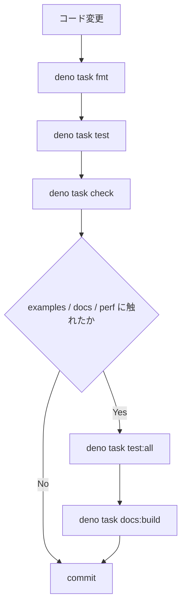

# 開発ガイド

繋ぎ屋 (tsunagiya) への貢献・開発参加のためのガイドです。

---

## 開発環境セットアップ

**Deno v2.x** が必要です。

```bash
deno --version  # v2.x であることを確認
```

セットアップ後、まず品質ゲートを確認します。

```bash
deno task check
```

`deno task check` には型チェック、lint、format 確認に加えて、
`scripts/guard_runtime_access.ts` による direct time/random access guard
が含まれます。

---

## コマンド一覧

| コマンド               | 説明                                            |
| ---------------------- | ----------------------------------------------- |
| `deno task test`       | ユニットテスト実行                              |
| `deno task test:all`   | 全テスト実行（`examples/` を含む）              |
| `deno task check`      | runtime guard + 型チェック + lint + format 確認 |
| `deno task fmt`        | コード自動整形                                  |
| `deno task docs:build` | ドキュメントビルド確認                          |
| `deno task build:npm`  | npm パッケージ生成確認                          |

```bash
deno task fmt
deno task test
deno task check
deno task test:all   # examples や AUTH/E2E に触ったとき
deno task docs:build # docs / README / shared snippet を触ったとき
```

---

## ディレクトリ構造

```text
src/
├── mod.ts                   # 公開エントリポイント
├── pool.ts                  # MockPool facade
├── relay.ts                 # MockRelay facade / orchestration
├── platform/                # WebSocket/fetch hook
├── relay/                   # EventStore, AuthService, DeliveryScheduler など
├── internal/                # clone/runtime/url/validation/search
├── types/                   # 内部型本体
└── testing/                 # EventBuilder / FilterBuilder / stream / wait

tests/
├── *_test.ts                # relay/pool/auth/filter/search/perf 回帰
└── testing/                 # helper 系テスト

docs/
├── _shared/                 # snippet / table の正本
├── reference/               # API / architecture / NIP doc
├── guide/                   # getting-started / tutorial / contributing
└── superpowers/plans/       # decision memo / closeout / perf note
```

詳細な責務分担は
[`2026-03-29-maintainer-operating-rules.md`](/superpowers/plans/2026-03-29-maintainer-operating-rules)
を正本とします。

---

## 開発ワークフロー

通常の変更では以下を実行します。



1. `deno task fmt`
2. `deno task test`
3. `deno task check`
4. `examples/`、AUTH 順序、E2E クライアント互換に触れたら `deno task test:all`
5. `docs/`、`README.md`、`docs/_shared/**` に触れたら `deno task docs:build`
6. 全て通ったら commit

---

## CI 必須導線

GitHub Actions では以下が常時実行されます。

- `guard-runtime-access`: `scripts/guard_runtime_access.ts`
- `test-deno`: `deno task check`、`deno task test`、coverage
- `docs-check`: docs lint/format + `deno task docs:build`
- `e2e-*`: example client の Deno / Node / Bun 互換確認

local では `deno task check` が guard の正本、CI では専用 job
と二重化して守ります。

---

## Docs / README 同期ルール

docs page 本文の正本は `docs/_shared/snippets/**` と `docs/_shared/tables/**`
です。 README は要約だけを持ち、shared snippet の複製を増やしません。

変更時は以下の順で揃えます。

1. 先に `docs/_shared/**` を更新する
2. include 先の `docs/reference/**` / `docs/guide/**` を確認する
3. README に同じ内容の要約があれば、必要最小限だけ同期する
4. `deno task docs:build` を通す
5. public-facing な説明が変わる場合は release readiness も更新する

---

## Performance Baseline 更新ルール

性能改善や threshold 更新を伴う変更では、コードだけでなく測定記録も残します。

必須ルール:

- smoke test は `tests/performance_test.ts`
- threshold 付き baseline は `tests/performance_baseline_test.ts`
- 新しい fast path を追加したら baseline を最低 1 本追加する
- threshold は単発観測で下げず、複数回の安定観測で決める
- 測定結果は `docs/superpowers/plans/` の dated note に残す

メモの最小テンプレート:

```md
# YYYY-MM-DD <Area> Notes

## 目的

## 実装

## 観測条件

- dataset:
- filter/query:
- run count:

## 観測値

- median:
- p95:
- memory proxy:

## Threshold 判断

- old threshold:
- new threshold:
- reason:

## 次の判断
```

---

## コーディング規約

- 公開 API は `src/mod.ts` / `src/testing/mod.ts` を正本にする
- `any` は使わず、必要なら `unknown` を使う
- エラーメッセージは英語で揃える
- テストでは `pool.uninstall()` を `finally` で保証する
- relay 本体と testing helper に direct `Date.now()` / `Math.random()` /
  `crypto.getRandomValues()` を追加しない
- 追加の ownership / sync rule は maintainers rule に追記してから広げる

---

## E2E テスト

```bash
deno task test      # tests/ のみ
deno task test:all  # tests/ + examples/
```

`globalThis.WebSocket` の差し替えが前提のため、Node.js で使う場合は WebSocket
polyfill（`ws` 等）が必要です。
