# アーキテクチャ

繋ぎ屋は `globalThis.WebSocket` を差し替えることで、既存の Nostr
クライアントコードを無変更でテスト可能にするモックライブラリです。

## 概要

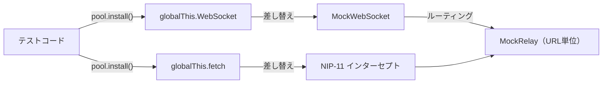

---

## コンポーネント構成

```
src/
├── pool.ts         MockPool       — 全体管理・WebSocket差し替え
├── relay.ts        MockRelay      — URL単位の仮想リレー
├── websocket.ts    MockWebSocket  — WebSocket API互換モック
├── filter.ts       matchFilter 等 — NIP-01フィルターマッチング（純粋関数）
├── auth.ts         AuthState      — NIP-42 AUTHチャレンジ/レスポンス
├── event_kind.ts                  — イベント種別判定（Regular/Replaceable/Ephemeral等）
├── logger.ts                      — ロガー
└── types.ts                       — 型定義
```

### クラス関係図

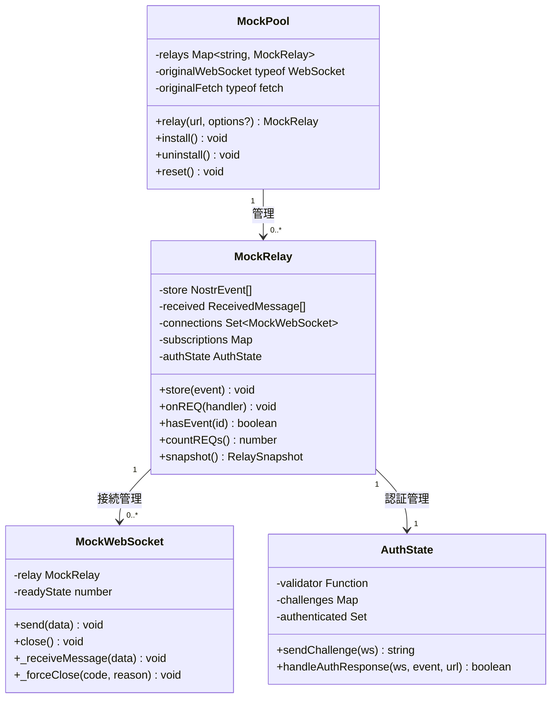

### MockPool (`src/pool.ts`)

複数の MockRelay を URL 単位で管理するコンテナ。テストのエントリポイント。

| 主要メンバー         | 型                         | 役割                                |
| -------------------- | -------------------------- | ----------------------------------- |
| `#relays`            | `Map<string, MockRelay>`   | URL → MockRelay のマッピング        |
| `#originalWebSocket` | `typeof WebSocket \| null` | uninstall 用に元の WebSocket を保存 |
| `#originalFetch`     | `typeof fetch \| null`     | uninstall 用に元の fetch を保存     |

**主要メソッド:**

- `relay(url, options?)` — MockRelay を登録・取得（同一 URL
  は既存インスタンスを返す）
- `install()` — `globalThis.WebSocket` と `globalThis.fetch` を差し替え
- `uninstall()` — 元の実装を復元
- `reset()` — 全リレーの状態をクリア

### MockRelay (`src/relay.ts`)

URL 単位で動作する仮想 Nostr
リレー。イベントのストア・フィルタリング・カスタムハンドラー・検証ヘルパー・不安定性シミュレート・NIP-42
AUTH を提供する。

| 主要フィールド   | 型                                               | 役割                             |
| ---------------- | ------------------------------------------------ | -------------------------------- |
| `#store`         | `NostrEvent[]`                                   | イベントストア（永続イベント）   |
| `#received`      | `ReceivedMessage[]`                              | 受信メッセージのログ             |
| `#connections`   | `Set<MockWebSocket>`                             | アクティブな接続一覧             |
| `#subscriptions` | `Map<MockWebSocket, Map<string, NostrFilter[]>>` | 接続ごとのサブスクリプション     |
| `#authState`     | `AuthState`                                      | NIP-42 認証状態                  |
| `#pendingTimers` | `Set<ReturnType<typeof setTimeout>>`             | 保留中タイマー（reset 時クリア） |

### MockWebSocket (`src/websocket.ts`)

`globalThis.WebSocket` の差し替え先。`EventTarget` を継承して WebSocket API
を模倣する。

| 主要メンバー                | 役割                                         |
| --------------------------- | -------------------------------------------- |
| `static _resolveRelay`      | MockPool が設定する URL → MockRelay 解決関数 |
| `#relay`                    | ルーティング先の MockRelay                   |
| `send(data)`                | `relay._handleMessage()` に転送              |
| `_receiveMessage(data)`     | リレーから呼ばれる受信コールバック           |
| `_forceClose(code, reason)` | リレーから強制切断                           |

### WebSocket readyState 遷移

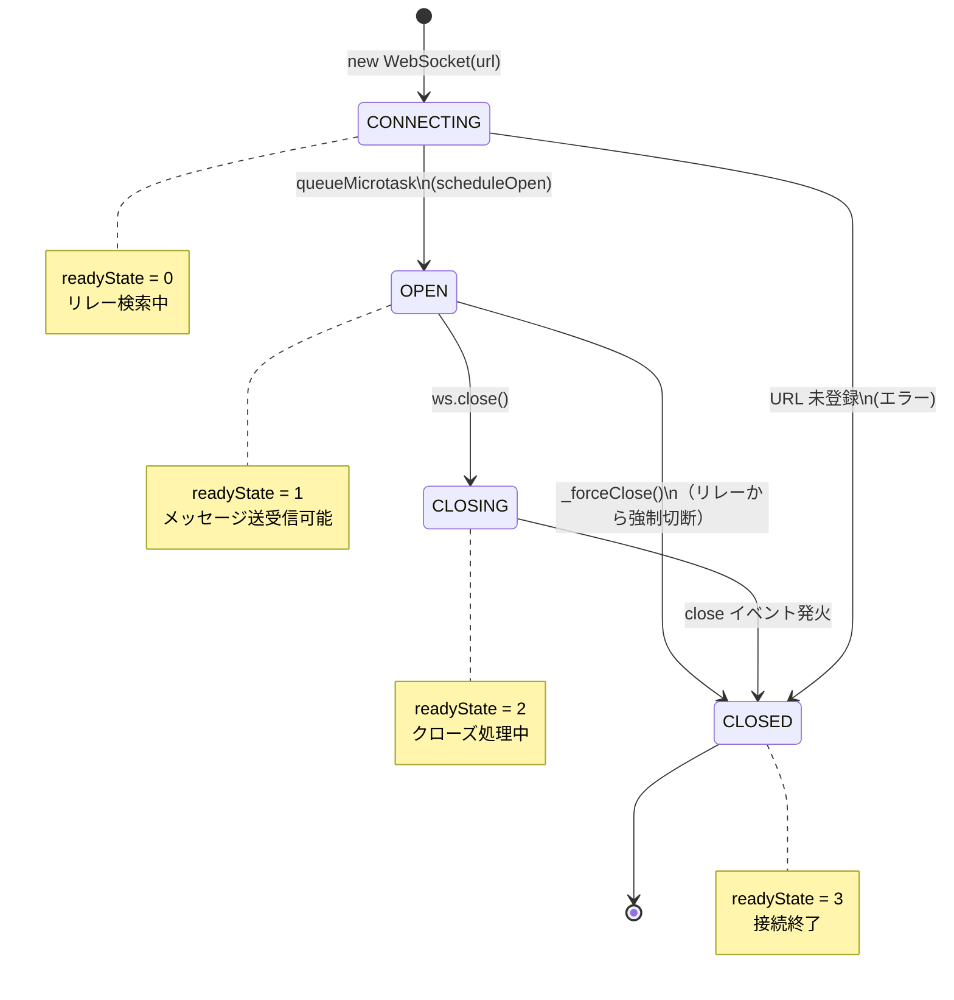

### filter.ts

NIP-01 フィルターマッチングの純粋関数群。副作用なし。

| 関数                           | 説明                                                     |
| ------------------------------ | -------------------------------------------------------- |
| `matchFilter(event, filter)`   | イベントが単一フィルターにマッチするか（全条件AND）      |
| `matchFilters(event, filters)` | 複数フィルターのいずれかにマッチするか（フィルター間OR） |
| `filterEvents(events, filter)` | イベント配列を絞り込み・降順ソート・limit 適用           |

### auth.ts (NIP-42)

接続ごとの AUTH チャレンジ/レスポンスを管理するクラス。

| メンバー                             | 役割                                               |
| ------------------------------------ | -------------------------------------------------- |
| `#validator`                         | カスタムバリデーター関数                           |
| `#challenges`                        | 接続 → チャレンジ文字列 のマッピング               |
| `#authenticated`                     | 認証済み接続の Set                                 |
| `sendChallenge(ws)`                  | ランダムチャレンジを生成して AUTH メッセージを返す |
| `handleAuthResponse(ws, event, url)` | kind:22242 の AUTH 応答を検証                      |

---

## WebSocket インターセプトの仕組み

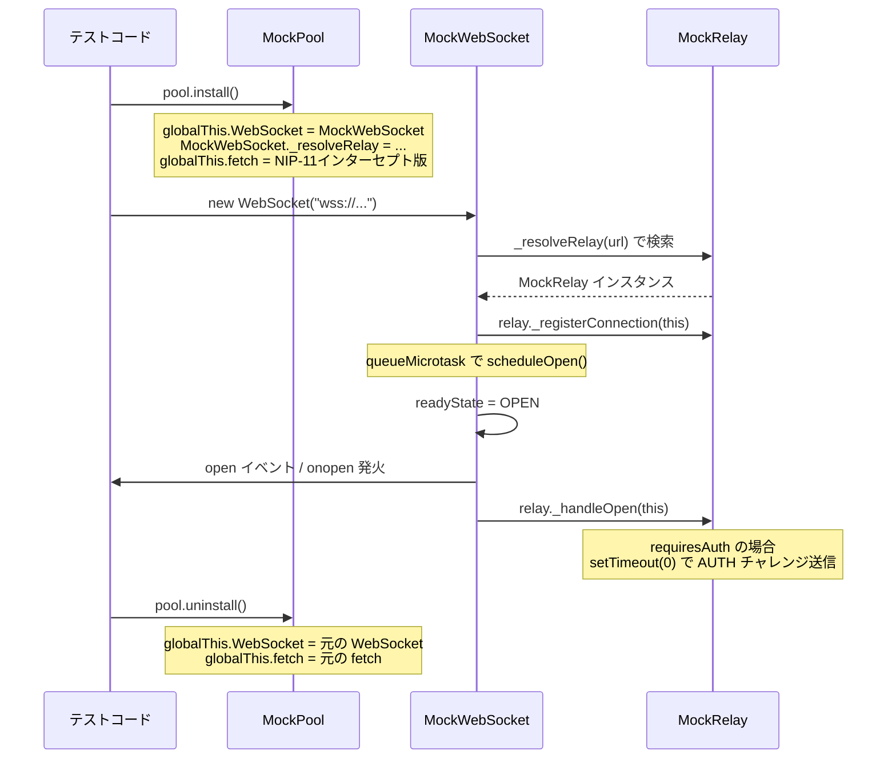

---

## メッセージフロー

### クライアント → リレー (send)

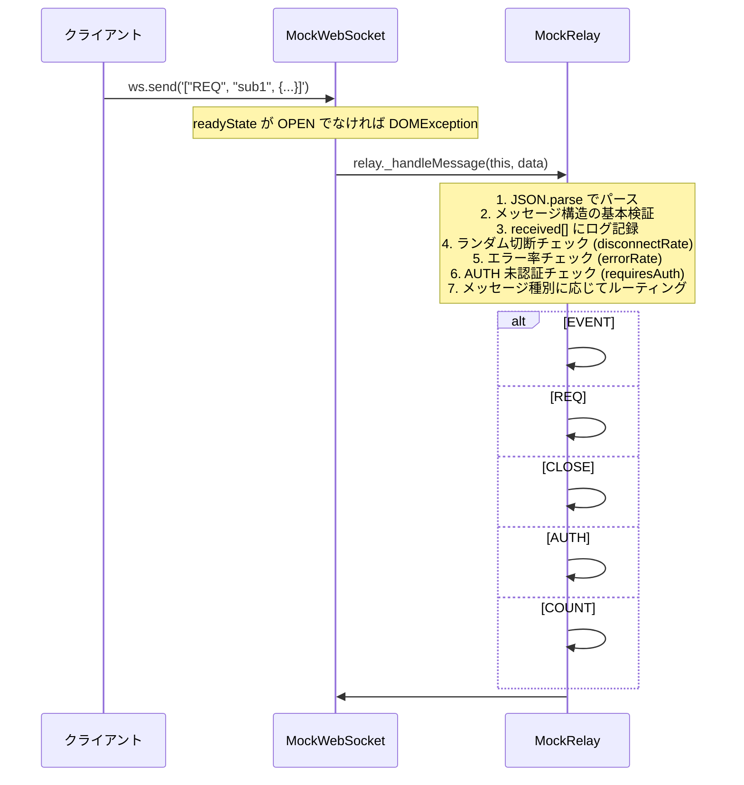

### エラーシミュレーション判定フロー

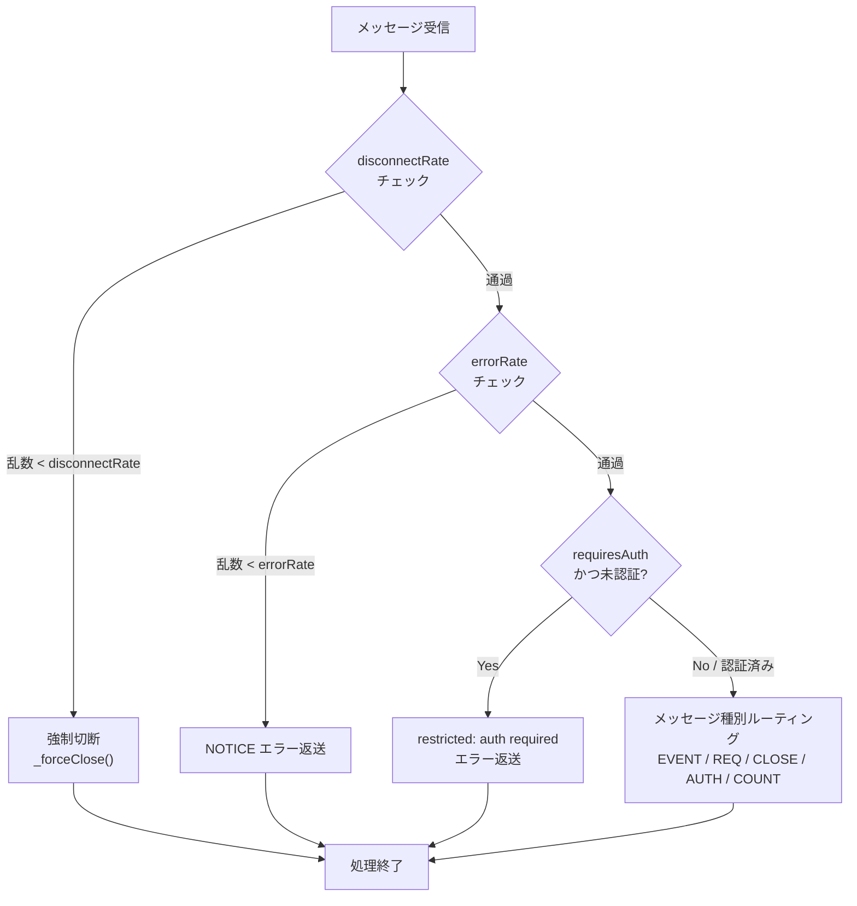

### リレー → クライアント (受信)

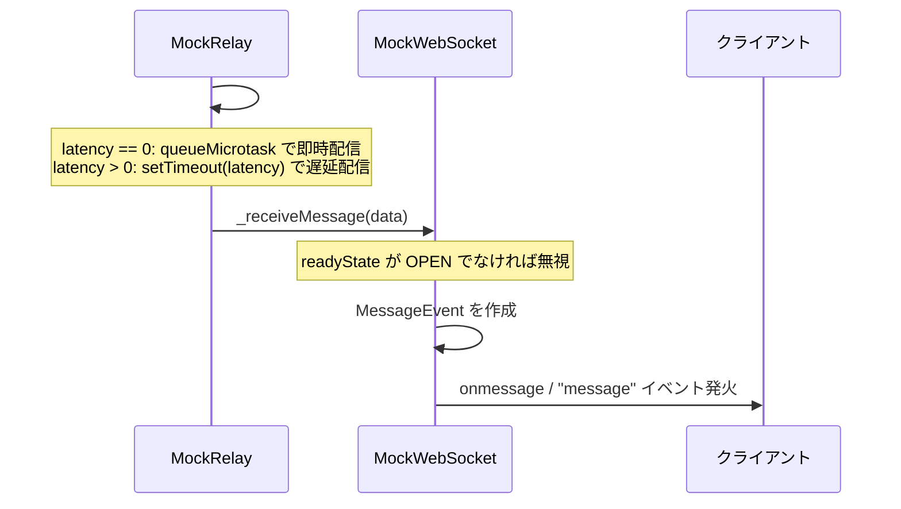

---

## データフロー

### イベントストア

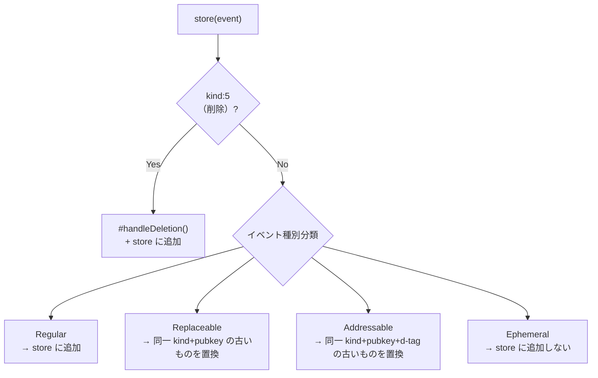

### イベント種別の分類フロー

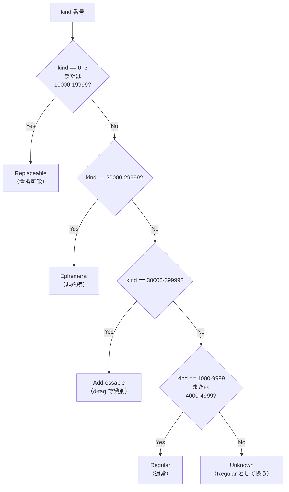

### REQ 処理とサブスクリプション管理

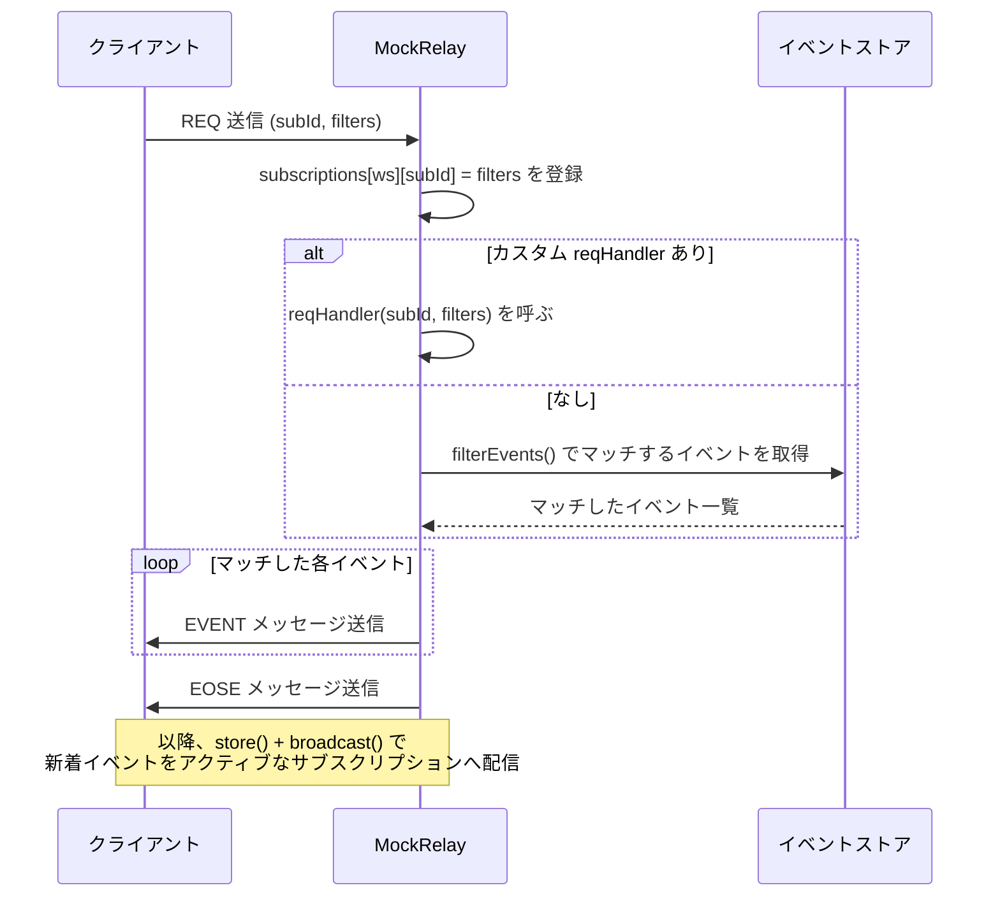

### サブスクリプションデータ構造

```
#subscriptions: Map<MockWebSocket, Map<string, NostrFilter[]>>

  ConnectionA ──→ { "sub1": [filter1, filter2],
                    "sub2": [filter3] }
  ConnectionB ──→ { "sub1": [filter4] }
```

---

## NIP 処理フロー

### NIP-42 AUTH フロー

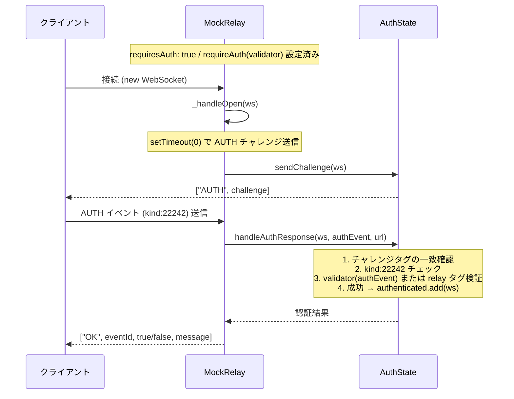

### NIP-09 削除処理フロー

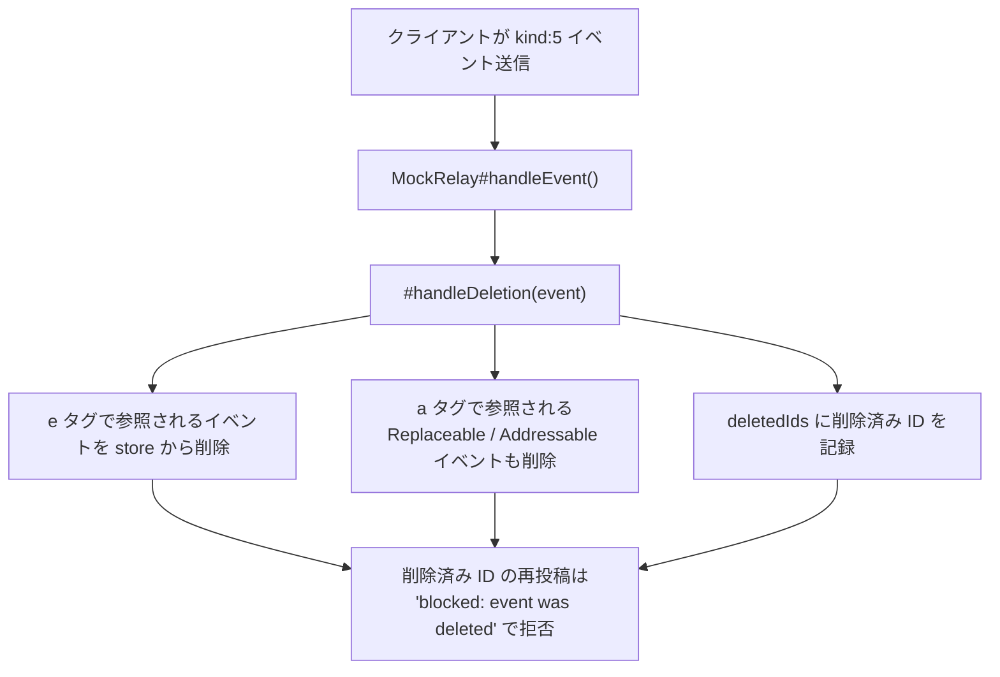

### NIP-11 リレー情報フロー

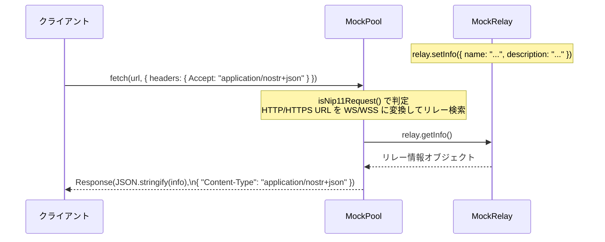

### イベント注入とリアルタイムストリーム

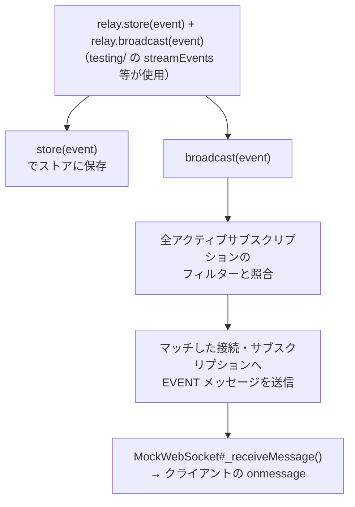

---

## テスト時のライフサイクル

```typescript
// 1. 初期化
const pool = new MockPool();
const relay = pool.relay("wss://relay.example.com");

// 2. 事前データ・設定
relay.store(event); // イベントを事前登録
relay.onREQ((subId, filters) =>
  // カスタムハンドラー
  customEvents
);

// 3. WebSocket 差し替え
pool.install();

try {
  // 4. テスト実行（クライアントコードをそのまま呼ぶ）
  const ws = new WebSocket("wss://relay.example.com");
  // ...

  // 5. 検証
  relay.hasEvent("abc123"); // イベント受信確認
  relay.countREQs(); // REQ 受信数確認
} finally {
  // 6. 必ず復元（テスト間の干渉を防ぐ）
  pool.uninstall();
}
```

---

## テストヘルパー全体像

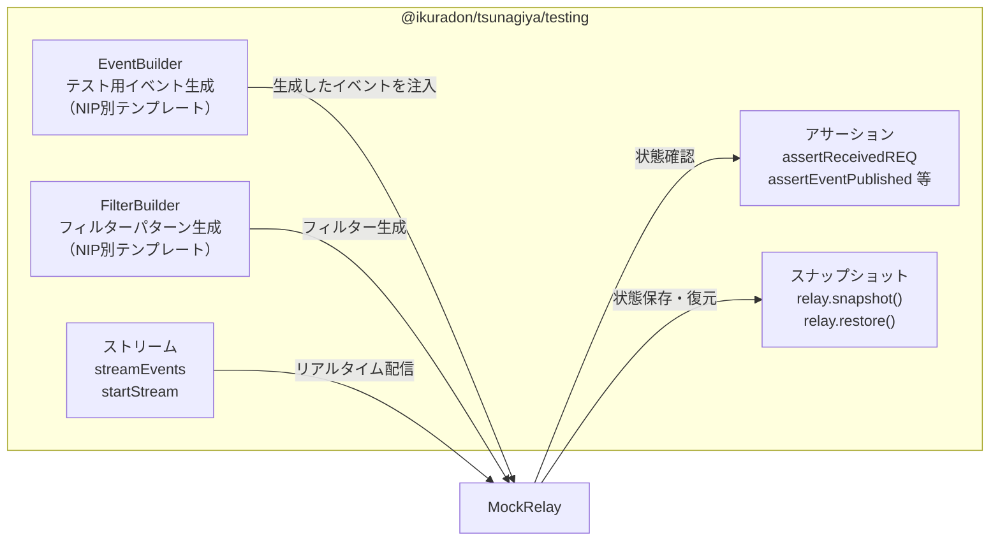

---

## 注意事項

- **テスト間の干渉**: `globalThis.WebSocket`
  の差し替えはグローバル操作のため、テストの `finally` ブロックで必ず
  `pool.uninstall()` を呼ぶこと
- **署名検証なし**:
  テスト用ライブラリとして、イベント署名は文字列として扱う（実際の暗号処理は依存を増やすため実装しない）。署名検証が必要な場合は
  `onEVENT` ハンドラーで独自に実装する
- **非同期配信**: レイテンシ 0 の場合でも `queueMicrotask`
  で非同期配信する（`send()`
  内で同期的にレスポンスを返すと一部クライアントが誤動作する）
- **単一インスタンス**: `MockPool` は同時に 1 インスタンスのみ `install` 可能
