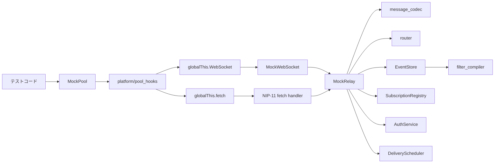
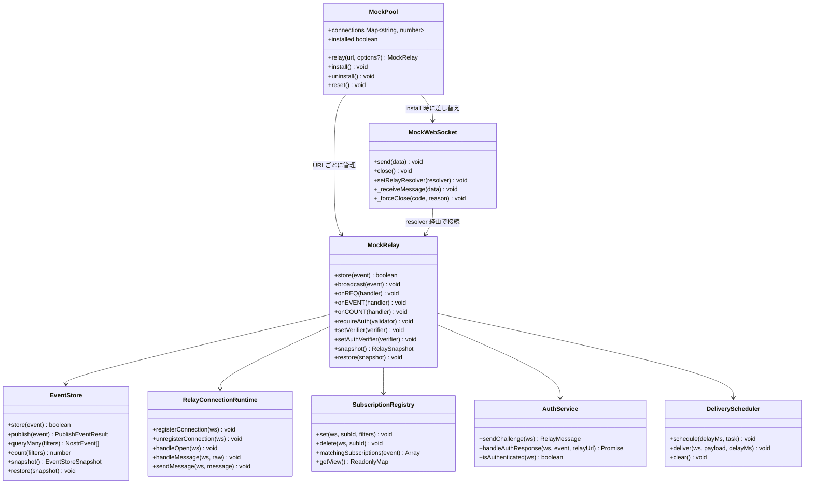
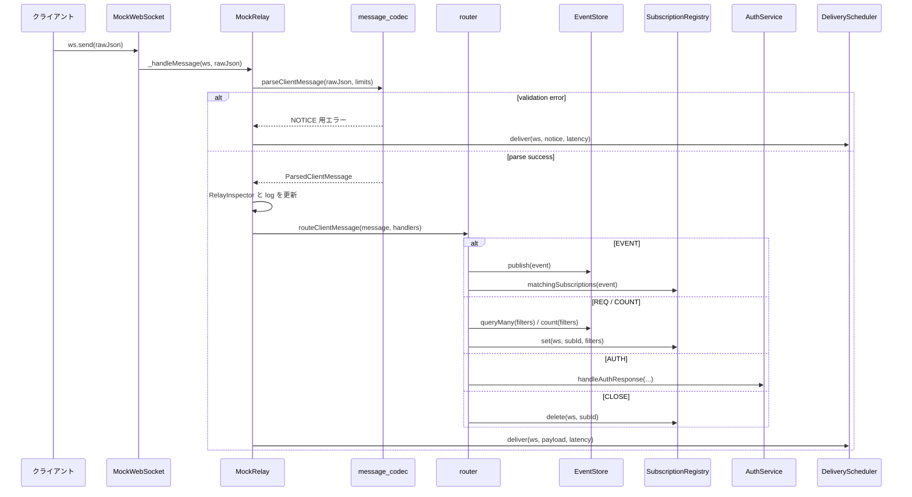
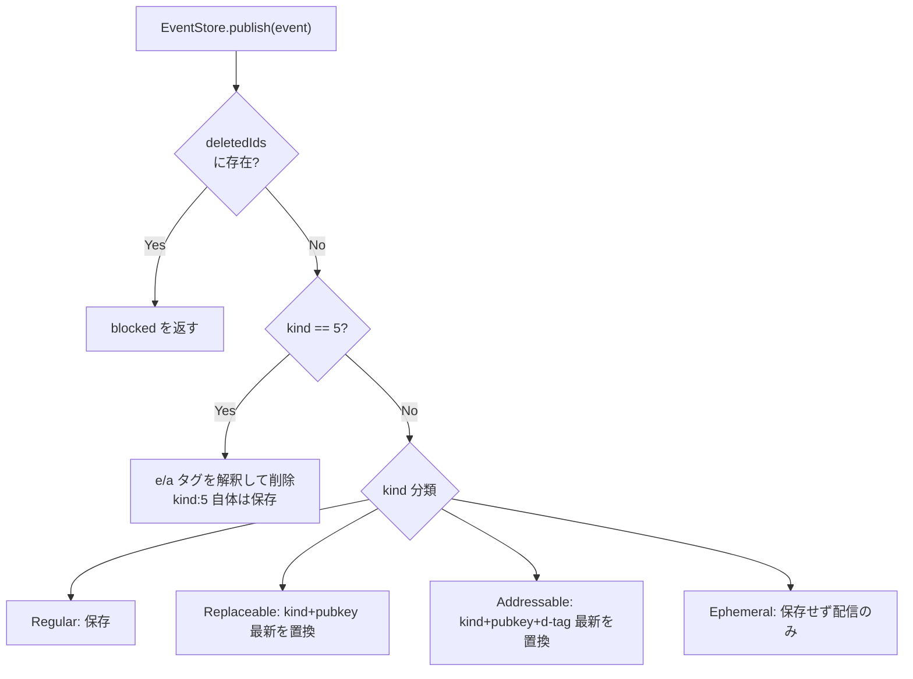
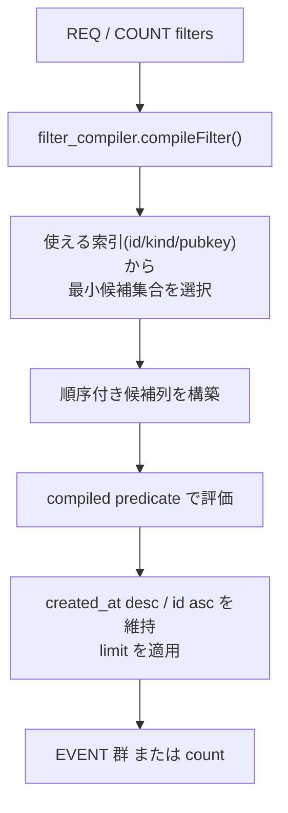
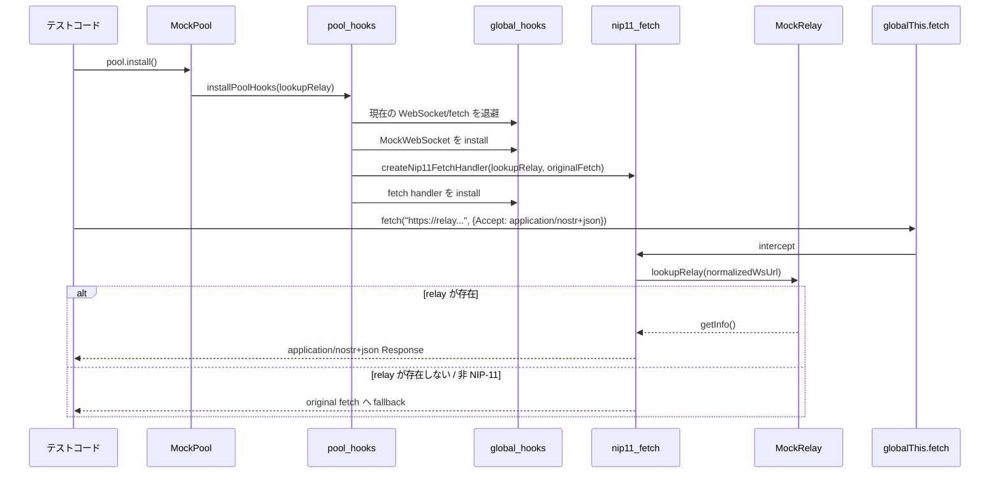

# アーキテクチャ

繋ぎ屋は `globalThis.WebSocket` と `globalThis.fetch` を差し替えることで、
既存の Nostr クライアントコードを無変更でテストできるモックライブラリです。

2026-03 の全面リファクタリングでは、公開 API を変えずに内部を責務分離しました。
`MockPool` と `MockRelay` は引き続きエントリポイントですが、実装本体は platform
hook、message codec、router、event store、auth、subscription、 delivery
に分割されています。

## 概要



## コンポーネント構成

```text
src/
├── pool.ts                       MockPool
├── relay.ts                      MockRelay（公開 API 用オーケストレータ）
├── websocket.ts                  MockWebSocket
├── auth.ts                       AuthState 互換エクスポート
├── filter.ts                     matchFilter / filterEvents
├── event_kind.ts                 kind 分類・replaceable 判定
├── logger.ts                     Logger
├── types.ts                      公開型定義の互換 re-export
├── types/
│   ├── nostr.ts                 Nostr event/filter/message 型
│   ├── relay.ts                 relay option/snapshot/handler 型
│   ├── runtime.ts               logger/clock/random/WebSocket readyState 型
│   └── testing.ts               stream option/handle 型
├── internal/
│   ├── clone.ts                  defensive copy
│   ├── runtime.ts                system clock / random defaults
│   ├── url.ts                    URL 正規化・NIP-11 判定
│   └── validation.ts             runtime shape validation
├── platform/
│   ├── global_hooks.ts           globalThis 差し替え/復元
│   ├── nip11_fetch.ts            NIP-11 fetch fallback/intercept
│   └── pool_hooks.ts             MockPool 用 install/uninstall
├── relay/
│   ├── auth_service.ts           AUTH challenge/validation
│   ├── connection_runtime.ts     接続集合・受信経路・配送起点
│   ├── delivery_scheduler.ts     timer 管理と配送
│   ├── error_messages.ts         エラー文言生成
│   ├── event_store.ts            保存・置換・削除・query/count
│   ├── filter_compiler.ts        compiled predicate / fast path
│   ├── message_codec.ts          parse + limit validation
│   ├── response_builders.ts      relay 応答メッセージ生成
│   ├── relay_inspector.ts        received/errors/authResults の診断境界
│   ├── router.ts                 message type dispatch
│   └── subscription_registry.ts  接続ごとの購読管理
└── testing/
    ├── assertions.ts
    ├── event_builder.ts
    ├── filter_builder.ts
    ├── snapshot.ts
    ├── stream.ts
    └── wait.ts
```

## 主要オブジェクト



`src/auth.ts` の `AuthState` は互換エクスポートです。実装本体は
`src/relay/auth_service.ts` にあります。接続数、AUTH 強制、parse/router
入口、ランダムエラー、NOTICE/OK/CLOSED の配送起点は
`src/relay/connection_runtime.ts` にあります。received / errors / authResults の
診断 API は `src/relay/relay_inspector.ts` に集約され、`MockRelay` は facade
のみを 提供します。`EventStore` は `id` / `kind` / `pubkey` に加えて tag
値索引も持ち、 `#e` / `#p` / `#d` を含む filter
の候補集合を狭めます。`MockRelayOptions.clock` と `MockRelayOptions.random`
を使うと、snapshot timestamp、ログ時刻、AUTH challenge、
latency/error/disconnect の乱択を決定論的に差し替えられます。公開型定義は
`src/types.ts` から見えますが、実体は `src/types/*` へ分割されています。

## 受信経路



ポイント:

- `message_codec.ts` が JSON parse、構造検証、サイズ制限を先に処理する
- `router.ts` は type ごとの dispatch だけを担当し、`MockRelay` に async error
  callback を返す
- `MockRelay` 本体は orchestration
  に寄せ、保存・購読・認証・配送は専用クラスへ委譲する

## ストアと問い合わせ

### 保存・置換・削除



`EventStore` は次の索引を持ちます。

- `idIndex`: `id -> Set<NostrEvent>`
- `kindIndex`: `kind -> Set<NostrEvent>`
- `pubkeyIndex`: `pubkey -> Set<NostrEvent>`
- `replaceableIndex`: `kind:pubkey -> latest event`
- `parameterizedIndex`: `kind:pubkey:d-tag -> latest event`

同 timestamp の replaceable / parameterized replaceable は、 `created_at`
が同じなら `id` の辞書順が小さい方を優先して保持します。

### REQ / COUNT fast path



ポイント:

- `REQ` と `COUNT` はフィルターごとに compiled predicate を使う
- 索引が使えない広いフィルターだけがフルスキャンへフォールバックする
- `restore()` 後は索引を再構築するため、snapshot 復元後も同じ fast path が使える

## Platform hook と NIP-11



`MockPool` 自体は global state を持たず、install/uninstall の責務は
`platform/pool_hooks.ts` に集約されています。

## 性能と安全性

| 項目                   | 現在の特性                                                                                                                   |
| ---------------------- | ---------------------------------------------------------------------------------------------------------------------------- |
| `REQ` / `COUNT`        | compiled filter + 索引選択で大規模ストア時の候補数を減らす                                                                   |
| `snapshot` / `restore` | deep copy を返し、`restore()` 時に索引を再構築する                                                                           |
| AUTH                   | challenge / authenticated を接続単位で保持し、ストア走査に依存しない                                                         |
| 配送                   | latency 0 は `queueMicrotask`、遅延配送は `DeliveryScheduler` が relay-wide batch flush で 1 本の timer へ集約する           |
| reset                  | `DeliveryScheduler.clear()`、購読、AUTH 状態、受信ログをまとめて初期化                                                       |
| 入力検証               | `max_message_length`、filter 数、`max_subid_length`、`max_limit`、`max_event_tags`、`max_content_length` を routing 前に拒否 |
| 署名検証               | EVENT 用 `setVerifier()` と AUTH 用 `setAuthVerifier()` を分離                                                               |

## 公開 API 互換性

このリファクタリングは内部構造の変更であり、公開 API の互換性を維持します。

- `MockPool`、`MockRelay`、`filter.ts`、`event_kind.ts` の公開エクスポートは維持
- `AuthState` は `AuthService` への互換ラッパーとして維持
- `@ikuradon/tsunagiya/testing` の helper 群は同じ import path で利用可能
- 安定対象は公開 export
  のみで、`src/internal/**`、`src/relay/**`、`src/platform/**`
  は内部実装として扱う

## テスト時のライフサイクル

```ts
const pool = new MockPool();
const relay = pool.relay("wss://relay.example.com");

relay.store(event);
pool.install();

try {
  const ws = new WebSocket("wss://relay.example.com");
  // テスト対象コードをそのまま実行
} finally {
  pool.uninstall();
}
```

実運用上の注意:

- `pool.install()` は同時に 1 インスタンスのみ
- テストでは `finally` で必ず `pool.uninstall()` する
- 固定 `setTimeout` より `testing/wait.ts` の `waitFor()` を優先する
- 内部モジュールを直接 import せず、公開 export を使う
